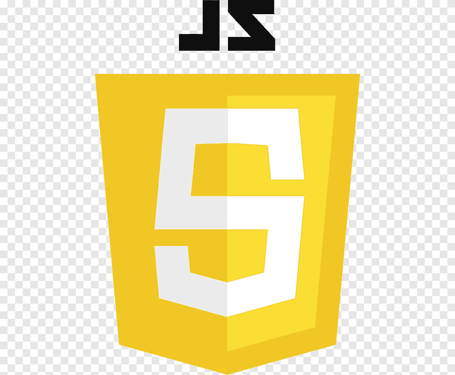
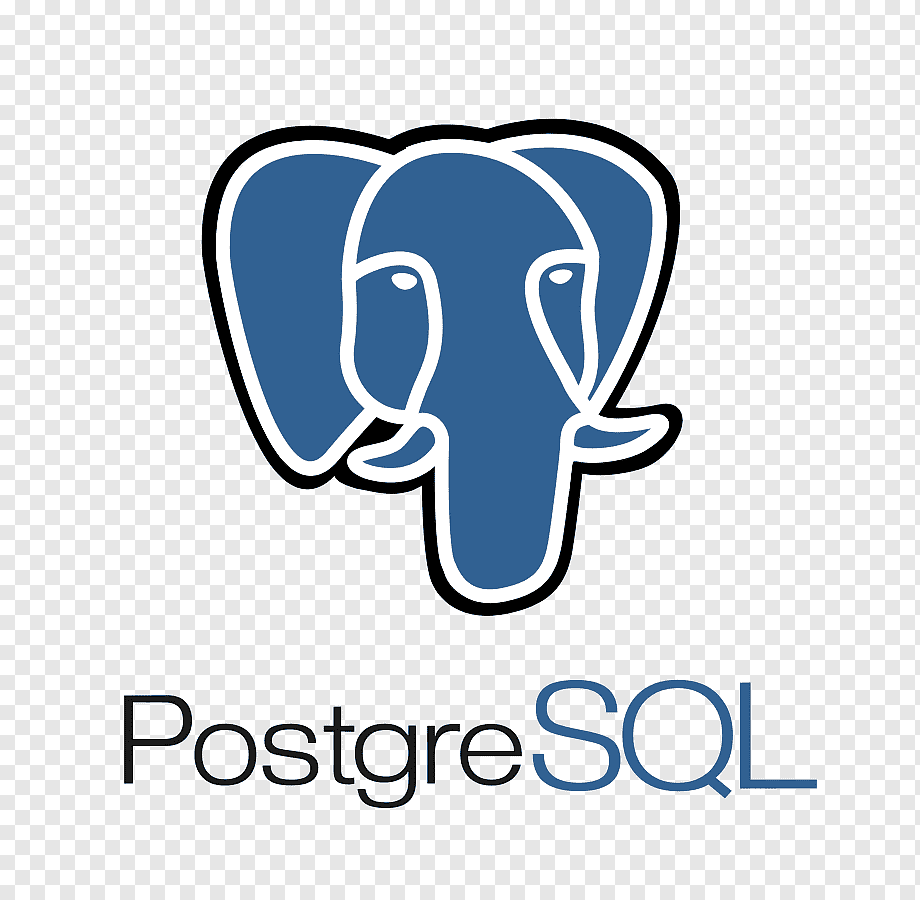
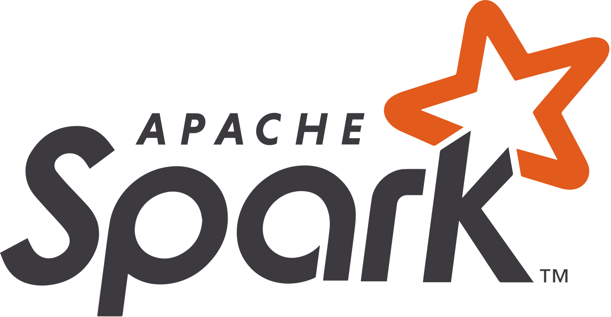

<!--- Your GitHub README.md file --->

  <h1 style="color: white;">👋 Hi, I'm Jhustie Mae</h1>

  

    I'm currently a 3rd year Computer Engineering student at Pamantasan ng Lungsod ng Maynila. I'm really excited about learning data engineering to boost both my academic and professional journey.
  

# About Me

  

    👀 I'm into becoming a Data Engineer and love picking up new tech stuff from different industries.
     
    🌱 Currently learning the ropes of Data Engineering.
     
    💞️ Excited to join cool projects and always open to new opportunities for learning and growth.
  

## Programming Languages I'm Familiar With

         

## How to Reach Me

  

    📫 You can reach me via:
     
    - <a href="mailto:jhustiecruz27@gmail.com">📧 jhustiecruz27@gmail.com</a>
     
    - <a href="https://www.linkedin.com/in/jhustie-mae-cruz-b081b629a/">🔗 LinkedIn:  Connect with me on LinkedIn</a>
  

