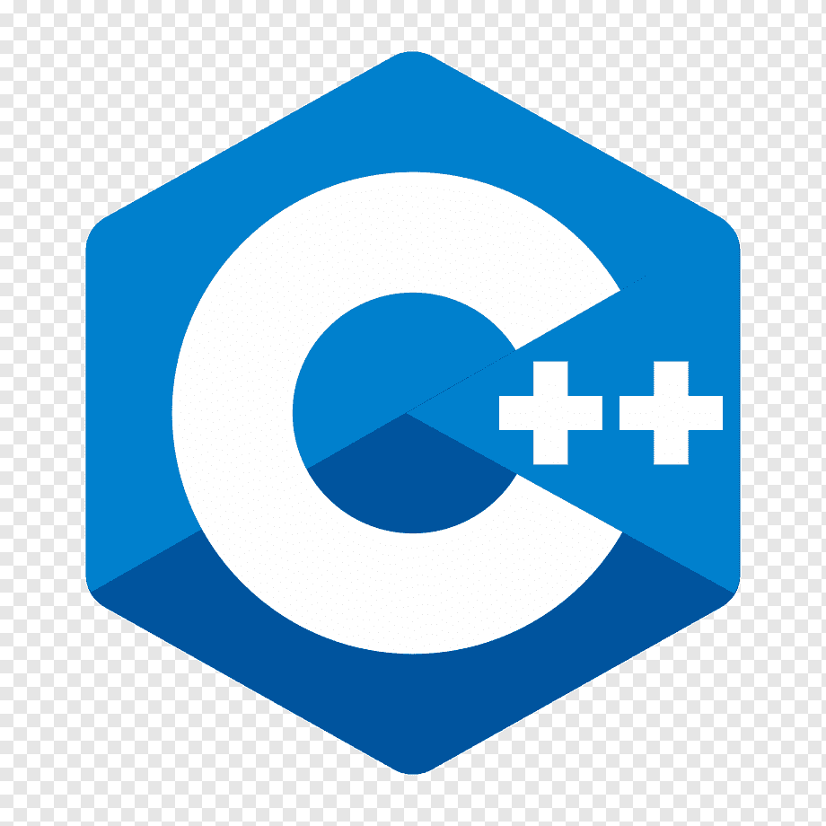
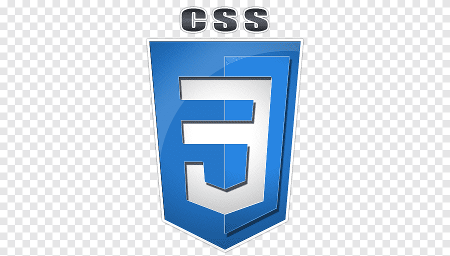
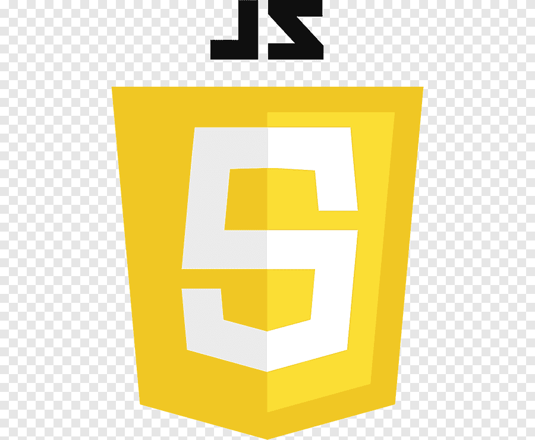
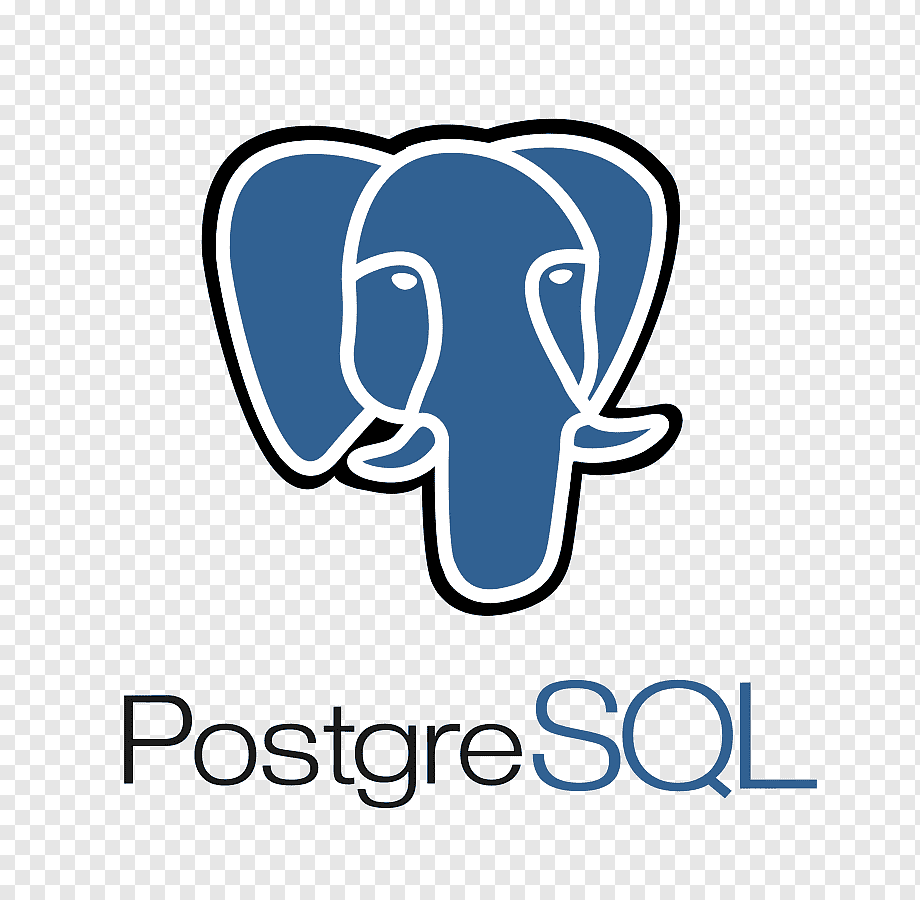
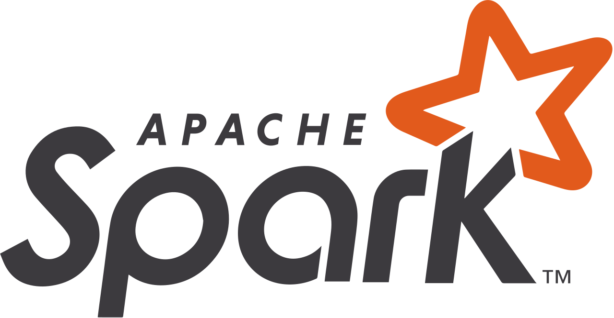

<!--- Your GitHub README.md file --->

  <h1 style="color: white;">👋 Hi, I'm Jhustie Mae</h1>

  

    I'm a <strong>Computer Engineering graduate (Cum Laude)</strong> from Pamantasan ng Lungsod ng Maynila and currently working as a <strong>Junior Programmer</strong>.
    I enjoy building solutions through code—whether for web, desktop, or mobile applications.
  

# About Me

  

    👀 Aspiring <strong>Full Stack Engineer</strong> with hands-on interest in <strong>web, desktop, and mobile application development</strong>. 
    🌱 Continuously learning and improving my skills in <strong>application development</strong>, while expanding my knowledge in <strong>Data Engineering, Cloud Computing, and Cybersecurity</strong>. 
    💞️ I enjoy grasping new concepts, building end-to-end solutions, and turning ideas into functional systems. 
    🚀 Motivated by growth, problem-solving, and creating impactful software across platforms.
  

## Programming Languages & Technologies

   
   
    
   
   
   
   
   
  

## Development Focus 🚀
- Web Applications  
- Desktop Applications  
- Mobile Applications  
- Data Engineering & Big Data  
- Cloud Technologies  
- Cybersecurity Fundamentals  

## How to Reach Me

  

    📫 You can reach me via: 
    - 📧 <a href="mailto:jhustiecruz27@gmail.com">jhustiecruz27@gmail.com</a>
  

